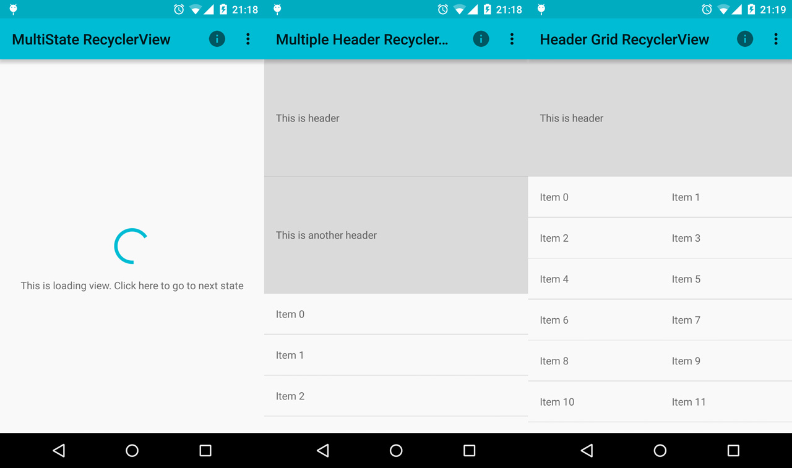

recyclerview-multistate-section-endless-adapter
================

MultiState, section, endless recyclerView are made easily by this wrapper adapter.  

We are working section support. I will be deployed soon. If you find that it still doesn't meet your need, don't hersitate to send us a request. We love to work with you to solve problems. [Send a request HERE](https://github.com/henrytao-me/recyclerview-multistate-section-endless-adapter/issues)


## Features

 


## Demo

[](https://play.google.com/store/apps/details?id=me.henrytao.mdcore)

Please note that the app on the Play store is not always the latest version. 


## Installation

Waiting for maven. 


## Usage

#### 1. Simple header and footer spacing

```
public class MaterialAdapter extends SimpleRecyclerViewAdapter {

  public MaterialAdapter(RecyclerView.Adapter baseAdapter) {
    super(baseAdapter);
  }

  @Override
  public RecyclerView.ViewHolder onCreateFooterViewHolder(LayoutInflater inflater, ViewGroup parent) {
    return new FooterHolder(inflater, parent, R.layout.item_spacing);
  }

  @Override
  public RecyclerView.ViewHolder onCreateHeaderViewHolder(LayoutInflater inflater, ViewGroup parent) {
    return new HeaderHolder(inflater, parent, R.layout.item_spacing);
  }
}
```

```
  ...
  
  @Override
  public void onViewCreated(View view, Bundle savedInstanceState) {
    super.onViewCreated(view, savedInstanceState);
    mSimpleAdapter = new SimpleAdapter();
    mMaterialAdapter = new MaterialAdapter(mSimpleAdapter);
    vRecyclerView.setHasFixedSize(false);
    vRecyclerView.setLayoutManager(new LinearLayoutManager(getActivity()));
    vRecyclerView.setAdapter(mMaterialAdapter);
  }
```

#### 2. More? 

Please checkout sample section. I have a lot more example there.

## Contributing

Any contributions are welcome!  
Please check the [CONTRIBUTING](CONTRIBUTING.md) guideline before submitting a new issue. Wanna send PR? [Click HERE](https://github.com/henrytao-me/recyclerview-multistate-section-endless-adapter/pulls)


## License

    Copyright 2015 "Henry Tao <hi@henrytao.me>"

    Licensed under the Apache License, Version 2.0 (the "License");
    you may not use this file except in compliance with the License.
    You may obtain a copy of the License at

        http://www.apache.org/licenses/LICENSE-2.0

    Unless required by applicable law or agreed to in writing, software
    distributed under the License is distributed on an "AS IS" BASIS,
    WITHOUT WARRANTIES OR CONDITIONS OF ANY KIND, either express or implied.
    See the License for the specific language governing permissions and
    limitations under the License.

